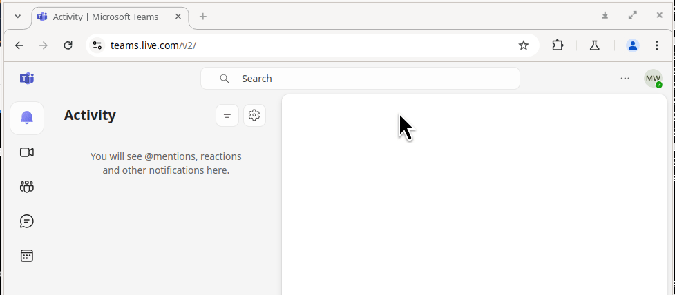
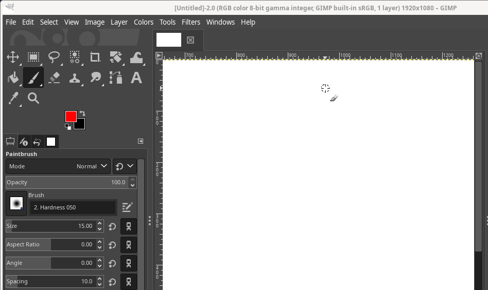
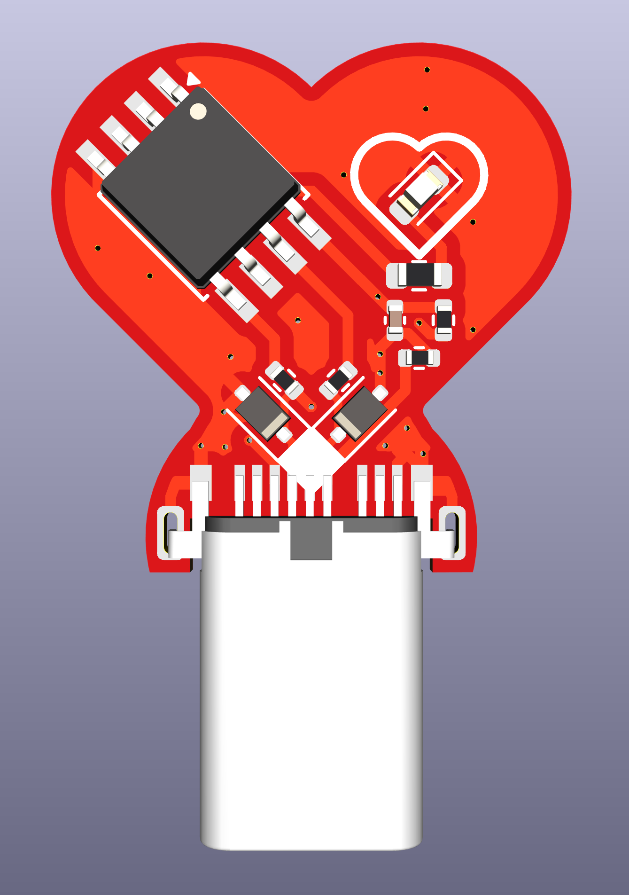
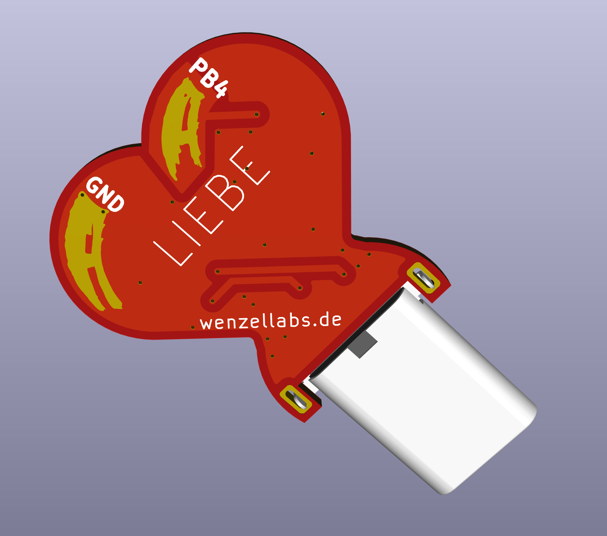

# LIEBE

the firmware for the LIEBE USB-C heart a.k.a. the HomeOfficeIdler.

moves your mouse to keep your status online/active/working.

I sell this board on <a href="https://lectronz.com/products/homeofficeidler">LECTRONZ</a>.

 
 
 
 

the firmware runs on an ATtiny85 and emulates a USB HID mouse in SW.
the mouse moves in heart shape.

 

I sell this board on <a href="https://lectronz.com/products/homeofficeidler">LECTRONZ</a>.

