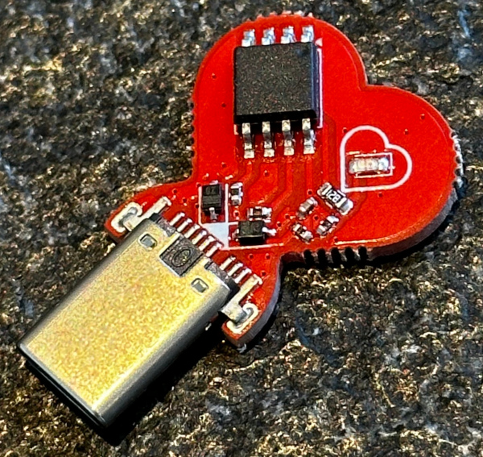
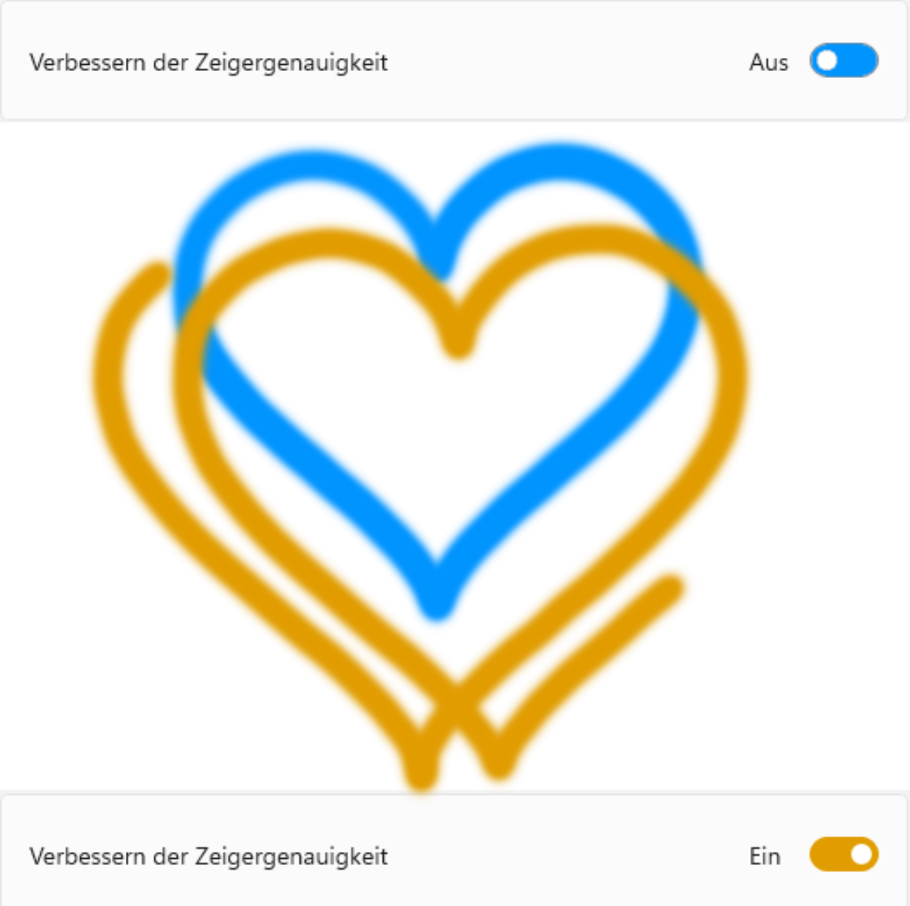
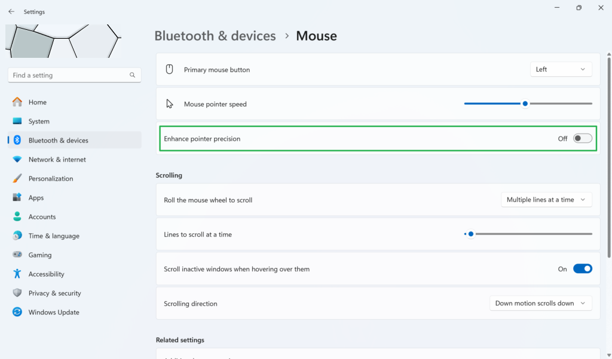

# LIEBE

a USB-stick that keeps your mouse moving.

no more screen savers, no more "away" in teams etc.

always keeps your status online/active/working - with love.

this repo is the firmware for the LIEBE USB-C heart a.k.a. the HomeOfficeIdler.

I sell this board on <a href="https://lectronz.com/products/liebe">LECTRONZ</a>.

I created this in 2011, but since the pandemic this type of device is also known as "mouse jiggler".

 
 
 
 

the firmware runs on an ATtiny85 and emulates a USB HID mouse in SW.
the mouse moves in heart shape.

 

 

 

## are you running on windows?

Microsoft created a setting that offsets the mouse trail of LIEBE, find and disable this setting to have a non-drifting heart again! thanks Jens!

 

you likely want the blue trail, not the orange trail.

 

I sell this board on <a href="https://lectronz.com/products/liebe">LECTRONZ</a>.

